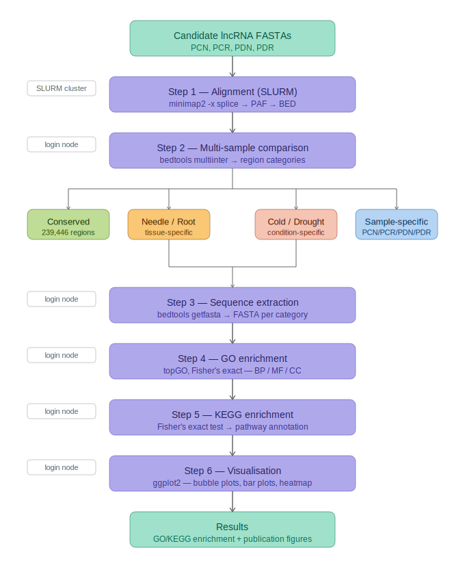

# comparative-lncRNA-pipeline


A comparative genomics pipeline for identifying and characterising tissue-specific and stress-responsive long non-coding RNAs (lncRNAs) in conifers using minimap2, bedtools, and GO/KEGG enrichment analysis.

Developed as part of an MSc thesis at Umeå University, initially applied to *Pinus sylvestris* under cold and drought stress across needle and root tissues. Extended to *Picea abies* (Norway spruce) including stress response and embryogenesis samples.

**Contact:** kvs.ms.2512@gmail.com · [KvS-25](https://github.com/KvS-25)

---

## Table of Contents

- [Pipeline Overview](#pipeline-overview)
- [Requirements](#requirements)
- [Installation](#installation)
- [Configuration](#configuration)
- [Running the Pipeline](#running-the-pipeline)
- [Output Structure](#output-structure)
- [Multi-species Analysis](#multi-species-analysis)
- [Citation](#citation)
- [License](#license)

---

## Pipeline Overview



The pipeline takes candidate lncRNA FASTAs (one per sample, from [Plant LncRNA Pipeline v2](https://github.com/xuechantian/Plant-LncRNA-pipeline-v2)) and runs six steps:

1. **Alignment** — minimap2 aligns each sample to the reference transcriptome (SLURM)
2. **Region comparison** — bedtools multiinter classifies regions as conserved, tissue-specific, condition-specific, or embryo-specific
3. **Sequence extraction** — bedtools getfasta extracts FASTA sequences per category
4. **GO enrichment** — topGO Fisher's exact test across Biological Process, Molecular Function, and Cellular Component
5. **KEGG enrichment** — Fisher's exact test against KEGG pathway database
6. **Visualisation** — UpSet plot, region count bar chart, GO bar plots, KEGG bubble plots

---

## Requirements

- [Micromamba](https://mamba.readthedocs.io/en/latest/installation/micromamba-installation.html) or Conda
- SLURM workload manager (for alignment step)
- Internet access (for KEGG pathway name retrieval during map building)

---

## Installation

**1. Clone the repository:**
```bash
git clone https://github.com/KvS-25/comparative-lncRNA-pipeline.git
cd comparative-lncRNA-pipeline
```

**2. Create environments:**
```bash
micromamba env create -f envs/alignment.yaml
micromamba env create -f envs/goanalysis.yaml

micromamba activate goanalysis
Rscript -e "install.packages(c('yaml', 'UpSetR'), repos='https://cloud.r-project.org')"
```

**3. Set up config:**
```bash
cp config/config.yaml.template config/config.yaml
nano config/config.yaml  # fill in your paths
```

---

## Configuration

`config/config.yaml` has a separate block for each species. You select which species to run at the command line — no need to edit the config when switching between species.
```yaml
pine:
  samples:
    names: [PCN, PCR, PDN, PDR]
  genome:
    reference: "/path/to/reference.fasta"
    annotation: "/path/to/eggnog.annotations.tsv.gz"
  ...

spruce:
  samples:
    names: [SCN, SCR, SDN, SDR, SSE, SZE]
  ...
```

Region categories are detected automatically from sample names:
- Names ending in `N` vs `R` → needle/root specific
- Second character `C` vs `D` → cold/drought specific
- `SSE` and `SZE` present → somatic/zygotic embryo specific

---

## Running the Pipeline

### With Snakemake (recommended)
```bash
micromamba activate snakemake

# Always dry run first to check everything looks right
snakemake --config species=pine --dry-run --cores 4

# Run on SLURM
snakemake --config species=pine --profile profiles/slurm --use-conda

# For spruce
snakemake --config species=spruce --profile profiles/slurm --use-conda
```

Snakemake handles step ordering automatically, including running GO and KEGG map building once and enrichment once per category.

### Manual step-by-step

For debugging individual steps only. In normal use, run Snakemake instead.
```bash
# Step 1: Align (submits SLURM array job, one task per sample)
sbatch scripts/01_align.sh

# Step 2: Multi-sample region comparison
bash scripts/02_multiinter.sh

# Step 3: GO enrichment
micromamba activate goanalysis

# Build gene-to-GO map once
Rscript scripts/03_go_analysis.R build_maps \
    /path/to/annotation.tsv.gz \
    results/GO_analysis/gene_to_GO.txt \
    results/GO_analysis/mstrg_to_refgene.txt

# Then run per category (repeat for each: root_specific, cold_specific, etc.)
Rscript scripts/03_go_analysis.R enrich \
    results/needle_specific.bed \
    results/GO_analysis/gene_to_GO.txt \
    results/GO_analysis/mstrg_to_refgene.txt \
    results/GO_analysis/needle_specific_refgenes.txt \
    results/GO_analysis/needle_specific_BP_GO_enrichment.txt

# Step 4: KEGG enrichment

# Build KEGG map once (fetches pathway names from KEGG API)
Rscript scripts/04_kegg_analysis.R build_maps \
    /path/to/annotation.tsv.gz \
    results/KEGG/gene_to_KEGG.txt \
    results/KEGG/kegg_pathway_names.txt

# Then run per category
Rscript scripts/04_kegg_analysis.R enrich \
    results/GO_analysis/needle_specific_refgenes.txt \
    results/KEGG/gene_to_KEGG.txt \
    results/KEGG/kegg_pathway_names.txt \
    results/KEGG/needle_specific_KEGG_enrichment.txt

# Step 5: Generate plots
Rscript scripts/05_plots.R
```

### Test run
```bash
cp config/config.yaml.template config/config.yaml
# Set genome.reference to test_data/reference/test_reference.fasta
# Set samples.directory to test_data/samples
# Set samples.names to [TEST1, TEST2]

snakemake --config species=pine --dry-run --cores 2
```

---

## Output Structure
```
results/
├── paf/                          # minimap2 alignment output
│   └── {SAMPLE}.paf
├── bed/                          # converted BED files
│   └── {SAMPLE}.bed
├── fasta/                        # extracted FASTA sequences per category
├── GO_analysis/
│   ├── gene_to_GO.txt
│   ├── mstrg_to_refgene.txt
│   ├── {CATEGORY}_refgenes.txt
│   └── {CATEGORY}_BP_GO_enrichment.txt
├── KEGG/
│   ├── gene_to_KEGG.txt
│   ├── kegg_pathway_names.txt
│   └── {CATEGORY}_KEGG_enrichment.txt
├── plots/
│   ├── upset_plot.png
│   ├── region_counts_bar.png
│   ├── GO_bar_{CATEGORY}.png
│   └── KEGG_bubble_{CATEGORY}.png
├── multiinter_output.bed
├── conserved.bed
├── needle_specific.bed
├── root_specific.bed
├── cold_specific.bed
├── drought_specific.bed
├── somatic_embryo_specific.bed   # only if SSE present
└── zygotic_embryo_specific.bed   # only if SZE present
```

---

## Multi-species Analysis

The pipeline is designed to be species-agnostic. It has been applied to *Pinus sylvestris* and extended to *Picea abies* (Norway spruce) for stress response and embryogenesis comparisons.

### Running for a new species

1. Obtain candidate lncRNA FASTAs using [Plant LncRNA Pipeline v2](https://github.com/xuechantian/Plant-LncRNA-pipeline-v2)
2. Obtain a reference transcriptome and eggNOG-mapper annotation
3. Add a species block to `config/config.yaml` following the template
4. Run:
```bash
snakemake --config species=yourspecies --profile profiles/slurm --use-conda
```

### Sample naming convention

| Code | Meaning |
|------|---------|
| PCN | Pine Cold Needle |
| PCR | Pine Cold Root |
| PDN | Pine Drought Needle |
| PDR | Pine Drought Root |
| SCN | Spruce Cold Needle |
| SCR | Spruce Cold Root |
| SDN | Spruce Drought Needle |
| SDR | Spruce Drought Root |
| SSE | Spruce Somatic Embryo |
| SZE | Spruce Zygotic Embryo |

The naming convention drives automatic category detection. For designs outside this convention, update the awk filter logic in `scripts/02_multiinter.sh` — see `docs/usage.md` for examples.

### Cross-species comparison

Run the pipeline separately for each species, then combine BED files for a joint multiinter analysis:
```bash
bedtools multiinter \
    -i results_pine/bed/*.bed results_spruce/bed/*.bed \
    -names PCN PCR PDN PDR SCN SCR SDN SDR \
    > results_combined/multiinter_output.bed
```

GO and KEGG enrichment results can be compared directly between species.

---

## Citation

Please see [CITATIONS.md](CITATIONS.md) for full citation information.

---

## License

MIT License — free to use and modify with attribution.